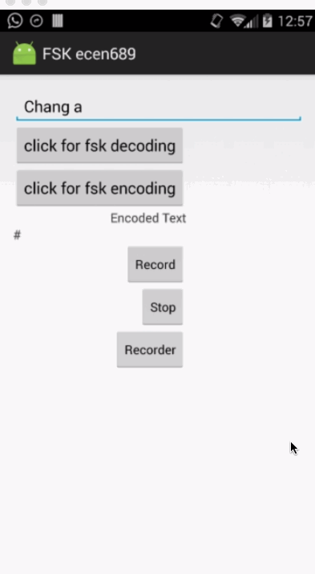

#Readme
##FSK
Frequency-shift keying (FSK) is a frequency modulation scheme in which digital information is transmitted through discrete frequency changes of a carrier signal. The technology is used for communication systems such as amateur radio, caller ID and emergency broadcasts  
Frequency Shift Key (FSK) signaling technology and signal conditioning provides significant advantages and benefits for economical and versatile distributed data acquisition and control requirements including communications accuracy, reliability and integrity in the transmission of digital, analog, discrete and pulse stream signals for monitoring and control applications. 

##Modulation
Frequency-shift keying (FSK) is a frequency modulation scheme in which digital information is transmitted through discrete frequency changes of a carrier signal. The technology is used for communication systems such as amateur radio, caller ID and emergency broadcasts  
Frequency Shift Key (FSK) signaling technology and signal conditioning provides significant advantages and benefits for economical and versatile distributed data acquisition and control requirements including communications accuracy, reliability and integrity in the transmission of digital, analog, discrete and pulse stream signals for monitoring and control applications. 

##Programs

##Screens

